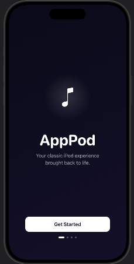
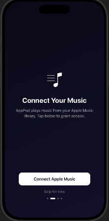
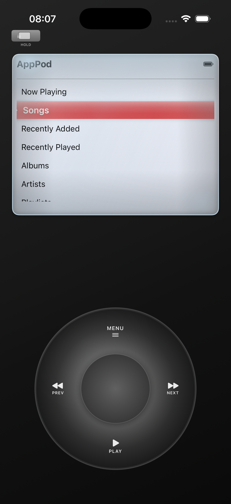
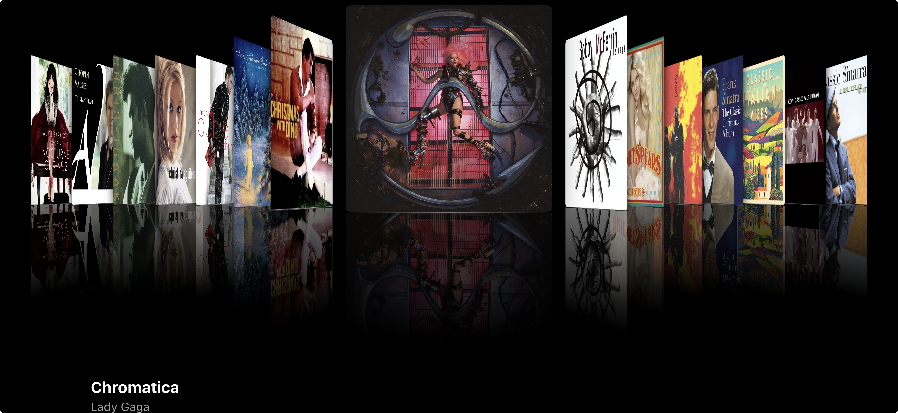

# AppPod

Your classic iPod experience, brought back to life.

AppPod is a SwiftUI iOS app that faithfully recreates the iPod Classic interface on your iPhone — complete with a touch-based click wheel, authentic navigation, and full Apple Music library integration.

---

## Screenshots

<p align="center">
  
  &nbsp;&nbsp;
  
  &nbsp;&nbsp;
  
</p>

<p align="center">
  
</p>

---

## Features

### Core iPod Experience
- **Touch Click Wheel** — Circular drag to scroll; tap zones for Menu, Play/Pause, Previous, Next, and center Select
- **Navigation Stack** — Menu button acts as a true back button with full history
- **Selection Memory** — Every screen remembers your scroll position when you return
- **Hold Switch** — Orange indicator at the top locks all input
- **Backlight Timer** — Auto-off: 5s / 10s / 30s / Always On; any touch wakes it
- **Haptic Feedback** — Ticks on scroll, medium on selection, heavy on center press, rigid on edge
- **Shake to Shuffle** — Shake the device to instantly shuffle all songs and jump to Now Playing

### Playback
- **Apple Music Library** — Browse and play Songs, Albums, Artists, Playlists, and Podcasts via MusicKit
- **Track Scrubbing** — Rotate the wheel on Now Playing to seek ±5 seconds per step
- **Repeat & Shuffle** — Toggle from the Now Playing screen using the center button
- **Background Audio** — Playback continues when the app is backgrounded or the screen is off
- **Cover Flow** — Rotate to landscape to browse Albums, Playlists, or Podcasts with 3D cover art

### Visual Polish
- **Glass Screen Overlay** — Gyroscope-driven light caustics, animated shimmer, grain texture, and chromatic fringing
- **Screen Parallax** — Content shifts counter to device tilt via CoreMotion
- **Selection Refraction** — Highlighted rows show glass-edge light refraction
- **29 Built-In Themes** — Styled after every major iPod era

### Themes

| Category | Themes |
|---|---|
| Classic | Classic White, Classic Black, Classic Silver, U2 Black & Red |
| Special | Black & White, Green Screen, Color Screen, iPod Nano |
| iPod Mini | Silver, Gold, Blue, Pink, Green |
| iPod Nano | Silver, Black, Space Gray, Blue, Pink, Purple, Green, Yellow, Orange, Red |
| iPod Shuffle | Silver, Blue, Pink, Green, Orange, Purple, Gold |

Each theme styles the body gradient, screen colors, highlight color, and click wheel.

---

## Requirements

- iOS 17.0+
- Xcode 16.0+
- Apple Developer account (MusicKit capability required)
- Physical iOS device (MusicKit needs a real device for full library access)
- Apple Music subscription or local library

---

## Setup

### 1. Add MusicKit Capability

1. Open `iMusic.xcodeproj` in Xcode
2. Select the **AppPod** target
3. Go to **Signing & Capabilities**
4. Click **+ Capability** → add **MusicKit**
5. Set your Team under Signing

### 2. Verify Info.plist

These keys are already present in `AppPod/Info.plist` but must remain intact:

```xml
<key>NSAppleMusicUsageDescription</key>
<string>AppPod plays music from your Apple Music library to give you the classic iPod experience.</string>

<key>UIBackgroundModes</key>
<array>
    <string>audio</string>
</array>
```

### 3. Build and Run

1. Select a physical iOS device as the run destination
2. Build and run (`⌘R`)
3. Grant Apple Music permission when prompted on first launch
4. Navigate with the click wheel

---

## Navigation

### Click Wheel Controls

| Gesture / Button | Action |
|---|---|
| Circular drag clockwise | Scroll down |
| Circular drag counter-clockwise | Scroll up |
| Tap top zone (MENU) | Go back |
| Tap bottom zone (PLAY) | Toggle Play/Pause |
| Tap left zone (PREV) | Restart track or skip to previous |
| Tap right zone (NEXT) | Skip to next track |
| Center circle (SELECT) | Select / confirm |

### Main Menu Structure

```
Menu
├── Now Playing
├── Songs
├── Recently Added
├── Recently Played
├── Albums
├── Artists
├── Playlists
├── Podcasts
└── Settings
    ├── Theme
    ├── Screen Size
    ├── Highlight Color
    ├── Scroll Sensitivity
    ├── Click Sound
    ├── Backlight
    └── About
```

### Cover Flow

Rotate to landscape while browsing Albums, Playlists, or Podcasts to enter Cover Flow. Swipe left/right to browse, tap to select.

### Shake to Shuffle

Shake the device from any screen (Hold disabled) to immediately shuffle all songs and navigate to Now Playing.

---

## Configuration

All settings are accessible from **Main Menu → Settings**:

| Setting | Options |
|---|---|
| Theme | 29 built-in themes |
| Screen Size | Auto (match theme) + 6 manual presets (Tiny → Extra Large) |
| Highlight Color | Default or 16 custom finish colors |
| Scroll Sensitivity | Low / Medium / High |
| Click Sound | On / Off |
| Backlight | 5 Seconds / 10 Seconds / 30 Seconds / Always On |

---

## Troubleshooting

**"No songs in library"**
Grant Apple Music permission in Settings → Privacy → Media & Apple Music, and make sure your library has content.

**Click wheel not responding**
Swipe in a circular arc around the outer ring. If it feels sluggish, increase sensitivity in Settings → Scroll Sensitivity.

**Playback doesn't start**
MusicKit requires an active internet connection for streamed content. Verify you're signed in to Apple Music in iOS Settings.

**Hold switch appears stuck**
Tap the orange toggle at the top of the device to unlock.

**Screen dims too quickly**
Go to Settings → Backlight and increase the duration or set Always On.

---

## Architecture

```
AppPod/
├── Models/
│   ├── AppMusicModels.swift            # AppTrack, AppAlbum, AppArtist wrappers
│   ├── ModelsiPodScreen.swift          # iPodScreen enum (all navigation states)
│   ├── ModelsSelectionState.swift      # SelectionState for scroll memory
│   ├── ModelsRepeatMode.swift
│   ├── ModelsShuffleMode.swift
│   ├── iPodTheme.swift                 # Theme colors + factory
│   ├── ThemeiPodThemeStyle.swift       # 29 theme cases + defaultScreenSize
│   ├── ThemeScreenSize.swift           # 6 screen size presets
│   └── iPodColors.swift               # Finish color palette
├── Services/
│   ├── MusicService.swift             # MusicKit + MPMediaPlayer integration
│   ├── AppHelpers.swift               # Shared utilities
│   └── AppMetrics.swift              # MetricKit crash/hang monitoring
└── ViewModels/
    ├── iPodView.swift                 # Root view — layout, orientation, shake
    ├── ClickWheelView.swift           # Wheel gestures + navigation logic
    ├── iPodScreenView.swift           # Screen content router
    ├── ModelsThemeSettings.swift      # ThemeSettings observable
    ├── NowPlayingView.swift
    ├── MainMenuView.swift
    ├── SongListView.swift
    ├── AlbumListView.swift / AlbumDetailView.swift
    ├── ArtistListView.swift / ArtistDetailView.swift
    ├── PlaylistListView.swift / PlaylistDetailView.swift
    ├── PodcastListView.swift / PodcastDetailView.swift
    ├── SettingsView.swift
    ├── CoverFlowView.swift
    ├── AlphabetScrubberView.swift
    └── HoldSwitchView.swift
```

**Key design notes:**
- Navigation is a `[iPodScreen]` stack managed in `iPodView`, driven by `ClickWheelView` via bindings
- Selection memory is a `[iPodScreen: SelectionState]` dictionary — O(1) save/restore on every transition
- `ThemeSettings` is a reference type in `@State`, passed down so changes propagate immediately without re-rendering the full tree
- The glass overlay is isolated to its own view so only it re-renders at 60 fps on gyroscope updates
- All async work uses Swift async/await — no Combine

---

## Adding a New Theme

See [`AppPod/Docs/ADD-NEW-THEME-GUIDE.md`](AppPod/AppPod/Docs/ADD-NEW-THEME-GUIDE.md). The short version:

1. Add a case to `iPodThemeStyle` in `Models/ThemeiPodThemeStyle.swift`
2. Add a `case` block in `iPodTheme.theme(for:)` in `Models/iPodTheme.swift`
3. Build — the theme appears in Settings → Theme automatically

---

## License

For educational and personal use. iPod, Apple Music, and MusicKit are trademarks of Apple Inc. This project is not affiliated with or endorsed by Apple.

## Credits

Built with SwiftUI, MusicKit, MediaPlayer, CoreMotion, and MetricKit.
Classic iPod design inspired by Apple's iconic music players from 2001–2014.
